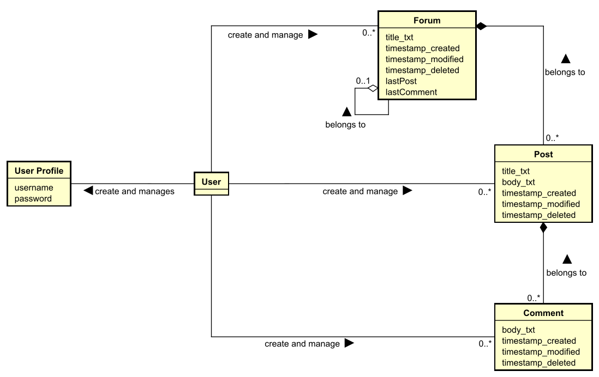
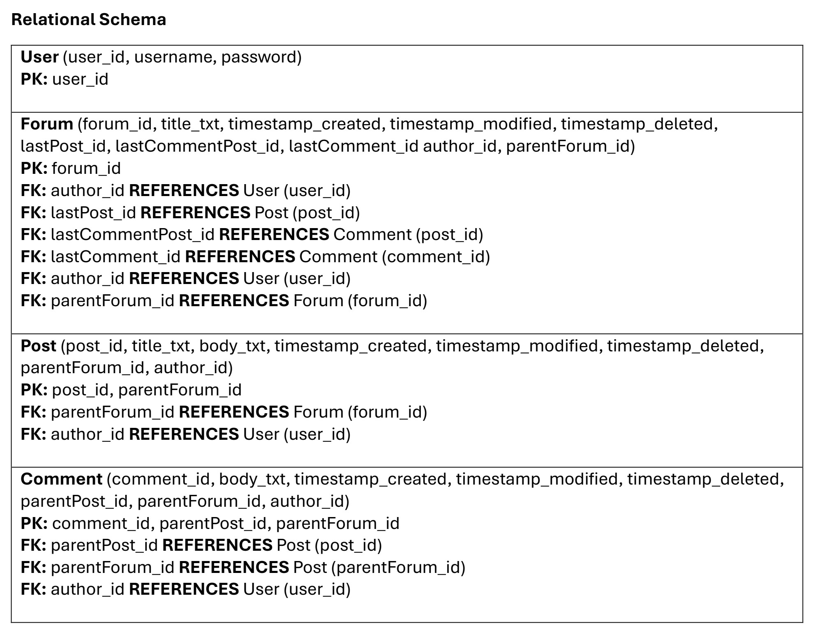
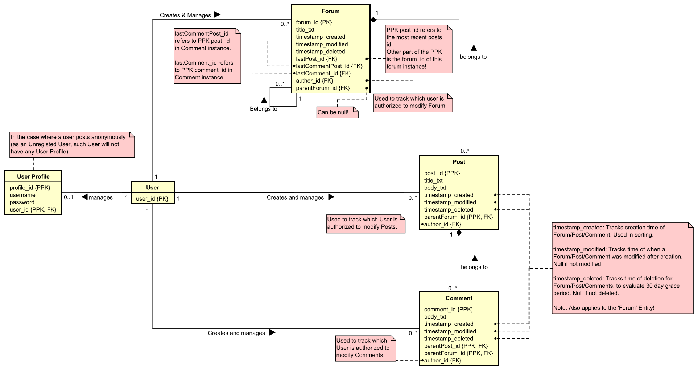

# DNP1-Assignment: Main Course Assignment

# Mandatory feature description
We need a User, having at least username, and a password. It needs an Id of type int. We need a Post. It is written by a User. It contains a Title and a Body. It also needs an Id, of type int. A User can also write a Comment on a Post. A Comment just contains a Body, and an Id of type int.
All entities must have an Id of type int. The way we create relationships between the Entities is described in detail further below. In short, we use foreign keys, rather than associations.

# Table of Contents:

 - [Mandatory feature description](#Mandatory-feature-description)
 - [User stories (Prioritized)](#User-stories-(Prioritized))
 - [Non-functional requirements](#Non-functional-requirements)
 - [Other considerations, not decided upon](#Other-considerations,-not-decided-upon)
 - [Use Case Diagram](#Use-Case-Diagram)
 - [Domain Model](#Domain-Model)
 - [Relational Schema](#Relational-Schema)
 - [Global Relations Diagram](#Global-Relations-Diagram)

# User stories (Prioritized)
  1.	<b>Mandatory:</b> Users want to be create posts containing a header (title) and body on in the forum, so that I can share information with other users. 
  2.	<b>Mandatory:</b> Users want to be able to read and comment on posts created by other users, so that information can be discussed between users. Each comment should contain a body of text, that is written by the user. 
  3.	<b>Mandatory:</b> Users want to be able to connect to a the forum with a personal username and password, so that different users can be distinguished and different users can be assigned as authors on the created posts and comments 
  4.  <b>Optional:</b> Users want to be able to choose their own username and password, as well as modify these later, so that users may keep their personal information up to date and improve security by allowing passwords to be updated 
  5.	<b>Optional:</b> Users want to be able to manage (edit/delete) Posts and Comments that the user has previously created, so that the user can keep information updated and fix potential errors or misspelling. 
  6.	<b>Optional:</b> Users want to comment on multiple Posts, as well as add multiple comments to each Post, so that multiple users can collaborate in the information sharing. 
  7.  <b>Optional:</b> Users want to be able to create main forums, as well as sub-forums, so that posts with related themes/topics can be collected inside containing forums and subforums for ease of finding posts with related topics. Each forum/subforum should be identifiable by its unique name. 
  8.  <b>Optional:</b> Users need to confirm any attempt to edit/delete previously created posts and comments, so that users do not edit/delete anything without informed consent. 
  9.  <b>Optional:</b> Users want to be able to see and restore deleted posts within 30 days of deletion, so that mistakes can be undone. 
  10.  <b>Optional:</b> Users want to be able to see the date and time of each post and comment, so that users are able to identify new and old informtation. 
  11.  <b>Optional:</b> Users want to be able to see the date and time of the most recent post or comment in each forum and sub-forum, so that users have a fast means of identifying if changes were made inside the forums they are interested in. 
 

# Non-functional requirements
-	Data types: 
  o	An id of type Int must be applied to each User class. 
  o	Each Post must contain a Title and a Body, as well as an Id of type Int. 
  o	Each Comment must contain a Body and an Id of type int. 
  o	All entities must have an Id of type int.  
- Rules when viewing the forum: 
  1.	Users should be able to see if any post or comment was edited. 
  2.  All forums and sub-forums must have unique names (on the same top-level). Example: There can not be 2 main forums called "General stuff", but each of these main forums can both have a sub-forum each called "General Stuff". Same rule applies on the sub-forum level. 

# Other considerations, not decided upon
- Should it be possible to modify and delete forums and sub-forums? 
- What if a user, who created a specific forum, wishes to delete said forum - but other users have already added posts and comments inside that forum? Tough luck? 
- How should posts and forums be sorted? By Date? By Name? Should be user be able to choose their own preference for sorting? 

# Use Case Diagram
  
# Domain Model

# Relational Schema
Based on the Domain Model, a relational schema has been written out (note: EER model is intentionally not displayed due to it being very similar to the Domain Model).

# Global Relations Diagram

