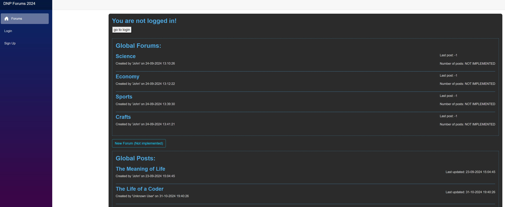
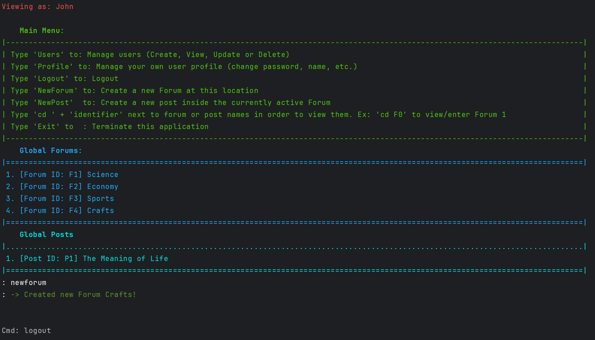

# DNP1-Assignment: Main Course Assignment

### To use with Web UI:
1. Initialize/Start the WebAPI project.
2. Initialize/Start the ClientApp project and wait for the webpage to be auto-launched inside your standard browser.
   

### To use with CLI:
1. Boot up the CLI, and follow on-screen instructions!
   

# Mandatory feature description
We need a User, having at least username, and a password. It needs an Id of type int. We need a Post. It is written by a User. It contains a Title and a Body. It also needs an Id, of type int. A User can also write a Comment on a Post. A Comment just contains a Body, and an Id of type int.
All entities must have an Id of type int. The way we create relationships between the Entities is described in detail further below. In short, we use foreign keys, rather than associations.

# Table of Contents:

 - [Mandatory feature description](#Mandatory-feature-description)
 - [Analysis](#Analysis)
   - [User stories (Prioritized)](#User-stories-(Prioritized))
   - [Non-functional requirements](#Non-functional-requirements)
   - [Other considerations, not decided upon (yet)](#Other-considerations,-not-decided-upon)
   - [Use Case Diagram](#Use-Case-Diagram)
   - [Domain Model](#Domain-Model)
 - [Design](#Design)
   - [UML Class Diagram](#UML-Class-Diagram)
   - [Relational Schema](#Relational-Schema)
   - [Global Relations Diagram](#Global-Relations-Diagram)

# Analysis

## User stories (Prioritized)
                = Implemented.          = Not implemented.

  1.	 <b>Mandatory:</b> Web Users want to be create posts containing a header (title) and body on in the forum, so that I can share information with other users.
  2.	 <b>Mandatory:</b> Web Users want to be able to read and comment on posts created by other users, so that information can be discussed between users. Each comment should contain a body of text, that is written by the user.
  3.	 <b>Mandatory:</b> Web Users want to be able to connect to a the forum with a personal username and password, so that different users can be distinguished and different users can be assigned as authors on the created posts and comments
  4.  <b>Optional:</b> Unregistered Users want to be able to create their own User Profile where they choose their own username and password, so that they may identify themselves on the forum and gain access to operations reserved for registered users.
  5.  <b>Optional:</b> Registered Users want to be able to modify their User Profile, including username and passwords, so that they may keep their personal information up to date and improve security by allowing passwords to be updated.
  6.	 <b>Optional:</b> Registered Users want to be able to manage (edit/delete) Posts and Comments that the user has previously created, so that the user can keep information updated and fix potential errors or misspelling.
  7.	 <b>Optional:</b> Web Users want to comment on multiple Posts, as well as add multiple comments to each Post, so that multiple users can collaborate in the information sharing.
  8.  <b>Optional:</b> Registered Users want to be able to create forums, as well as sub-forums, so that posts with related themes/topics can be collected inside containing forums and subforums for ease of finding posts with related topics. Each forum/subforum should be identifiable by its unique name.
  9.  <b>Optional:</b> Registered Users want to have to confirm any attempt to edit/delete previously created posts and comments, so that users do not edit/delete anything without informed consent.
  10.  <b>Optional:</b> Registered Users want to be able to see and restore forums and posts they have deleted within 30 days of deletion, so that mistakes can be undone.
  11.  <b>Optional:</b> Web Users want to be able to see the date and time of each post and comment, so that users are able to identify new and old informtation.
  12.  <b>Optional:</b> Web Users want to be able to see the date and time of the most recent post or comment in each forum and sub-forum, so that users have a fast means of identifying if changes were made inside the forums they are interested in.
  13.  <b>Optional:</b> Registered Users want to be able to logout from the forum, so that each user can control access to their own profiles and content and maintain a healthy security practice on computers with multiple users.

## Non-functional requirements
- Data types:
  1. 	An id of type Int must be applied to each User class.
  2. 	Each Post must contain a Title and a Body, as well as an Id of type Int.
  3. 	Each Comment must contain a Body and an Id of type int.
  4. 	All entities must have an Id of type int.
  5.	Passwords must strong (min. 12 characters, min. 1 lowercase letter, min. 1 uppercase letter, min. 1 number).
  6.	Passwords should be stored as hashes of the txt equivalent, to improve security in the case of database compromisation. Possibly hardcore a fixed encryption string inside the code.

 
- Rules when viewing the forum:
  1.	Users should be able to see if any post or comment was edited.
  2.  All forums and sub-forums must have unique names (on the same top-level). Example: There can not be 2 main forums called "General stuff", but each of these main forums can both have a sub-forum each called "General Stuff". Same rule applies on the sub-forum level.
  3. When unregistered users post, the unregistered user should be assigned an "anonymous" name as standard, so unregistered users do not impersonate registered users.
  4. When posting posts or comments as an unregistered user, a warning should be displayed notifying the user of not being logged in, so registered users don't mistakenly post while not logged in.

  

## Other considerations, not decided upon
- Should it be possible to modify and delete forums and sub-forums?
- What if a user, who created a specific forum, wishes to delete said forum - but other users have already added posts and comments inside that forum? Tough luck?
- How should posts and forums be sorted? By Date? By Name? Should be user be able to choose their own preference for sorting?
- Should it be possible to limit access to certain forums and posts, so that only registered (or certain) users may view these?
- Should it be possible to ban certain users, IPs, etc.?
- Should it be possible to add forum moderators?
- Should it be possible to add admins?
- How can I further improve password handling? Seperate usernames and passwords in the database? Implement hashing of usernames and passwords when storing?

## Use Case Diagram

  
## Domain Model

# Design

## UML Class Diagram
Not added yet.

## Relational Schema
Based on the Domain Model, a relational schema has been written out (note: EER model is intentionally not displayed due to it being very similar to the Domain Model).

## Global Relations Diagram

